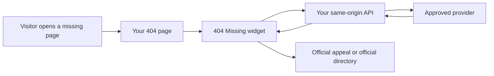
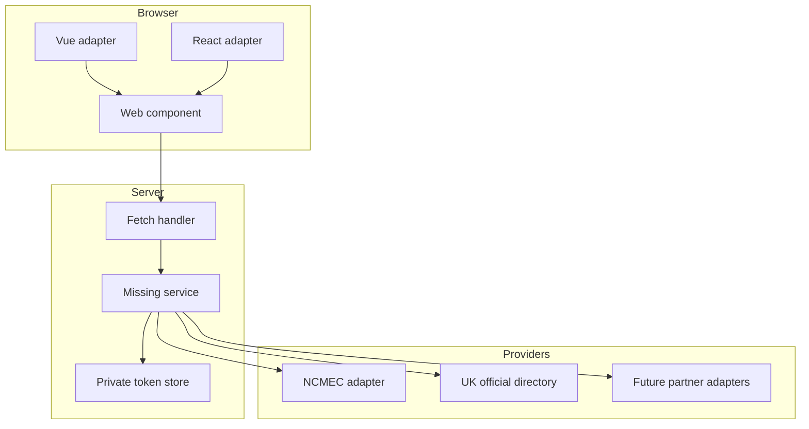
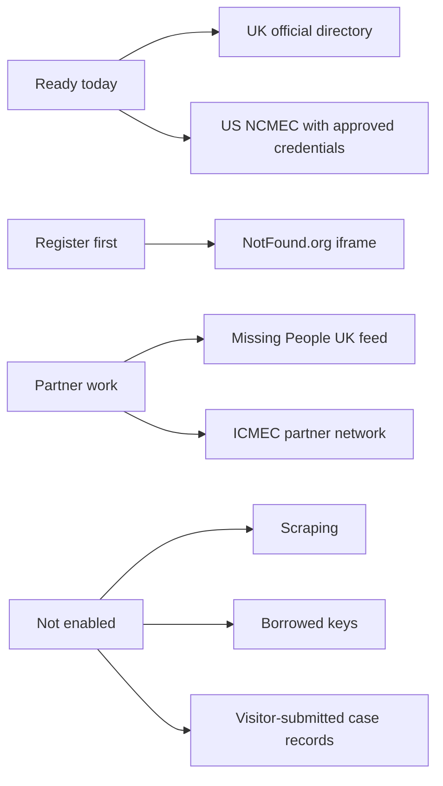

# 404 Missing

Turn a dead link into a chance to help.

404 Missing is a tiny, self-hosted toolkit for showing a current missing-child
appeal on a website's 404 page. It gives developers a simple API route, a web
component, framework adapters and an MCP helper. Provider keys stay on your
server. Visitors get a useful page instead of a dead end.



## Five-Minute Path

0. Use Node 22+. For inline US appeals, get your own
   [NCMEC approval](https://www.missingkids.org/gethelpnow/search/poster-api-registration).
   UK works today as an official directory link while partner feed access is
   arranged.

1. Install the current release:

   ```sh
   npm install https://github.com/dilrajahdan/404-missing/releases/download/v0.1.0/dappa-404-missing-0.1.0.tgz
   ```

2. Put provider credentials in server-only environment variables:

   ```dotenv
   NCMEC_CLIENT_ID=your-own-approved-client-id
   NCMEC_CLIENT_SECRET=your-own-approved-client-secret
   ```

3. Create a same-origin API route:

   ```ts
   import { createMissing404Handler } from '@dappa/404-missing/server'
   import { createFileTokenStore } from '@dappa/404-missing/node'

   export const missingChildrenHandler = createMissing404Handler({
     defaultCountry: 'GB',
     ncmec: {
       clientId: process.env.NCMEC_CLIENT_ID || '',
       clientSecret: process.env.NCMEC_CLIENT_SECRET || '',
       tokenStore: createFileTokenStore('/var/lib/your-app/private/404-missing-ncmec-token.json'),
     },
   })
   ```

4. Render the widget on your 404 page:

   ```html
   <missing-child country="GB" endpoint="/api/missing-children">
     <a href="https://www.missingpeople.org.uk/appeal-search">Official UK appeals</a>
   </missing-child>
   <script type="module">
     import { registerMissingChild } from '@dappa/404-missing/widget'
     registerMissingChild()
   </script>
   ```

5. Visit a real missing URL on your site. Passing result: the response is still
   HTTP 404, the home link is visible, the card loads, the official directory is
   available and provider photos only load through your same-origin API.

Need the exact React, Vue, Ember, Astro or plain HTML version? Start here:
[docs/patterns.md](docs/patterns.md).

## Choose Your Integration

| If you use | Use this | Start here |
| --- | --- | --- |
| React or Next.js | React adapter plus one API route | [Simple patterns](docs/patterns.md#react-or-nextjs) |
| Vue or Nuxt | Vue adapter plus one API route | [Simple patterns](docs/patterns.md#vue-or-nuxt) |
| Ember | Web component plus one API route | [Simple patterns](docs/patterns.md#ember) |
| Astro | Web component plus one endpoint | [Simple patterns](docs/patterns.md#astro) |
| Any HTML page | Web component plus Fetch route | [Simple patterns](docs/patterns.md#html-or-any-framework) |
| Agents or IDE assistants | Local MCP server | [MCP guide](docs/mcp.md) |

## What Developers Get



- `@dappa/404-missing/server`: provider interface, NCMEC provider, service and
  Fetch handler, plus `createMissing404Handler` for the common config path.
- `@dappa/404-missing/widget`: the framework-neutral custom element.
- `@dappa/404-missing/vue`: a small Vue wrapper for Nuxt.
- `@dappa/404-missing/react`: an SSR-safe React wrapper for Next.js.
- `@dappa/404-missing/node`: a private file token store for persistent Node
  servers.
- `@dappa/404-missing/netlify`: a private Netlify Blobs token store.
- `404-missing-mcp`: local MCP tools for provider status and integration
  guidance.

## API Shape

```sh
curl 'https://your-site.example/api/missing-children/appeal?country=US&region=OH'
```

The API returns one of two useful states:

```json
{
  "version": 1,
  "status": "ok",
  "country": "US",
  "match": "region",
  "appeal": {
    "name": "Official provider name",
    "officialUrl": "https://official-provider.example/appeal",
    "photoPath": "provider/photo/path"
  },
  "fallback": {
    "label": "View official US appeals",
    "url": "https://www.missingkids.org/gethelpnow/search"
  }
}
```

or:

```json
{
  "version": 1,
  "status": "unavailable",
  "country": "GB",
  "match": "none",
  "reason": "no-local-provider",
  "appeal": null,
  "fallback": {
    "label": "View official UK appeals",
    "url": "https://www.missingpeople.org.uk/appeal-search"
  }
}
```

`unavailable` is a valid `200` response. It means the page can still help by
linking to the official directory.

## Safety Defaults

404 Missing is built around a few non-negotiables:

- Provider credentials never go into browser code, public config or MCP prompts.
- Case records and photos are not cached on disk.
- Appeal and photo responses use `Cache-Control: no-store` and
  `X-Robots-Tag: noindex, nofollow`.
- A missing page stays HTTP 404.
- The package does not guess a visitor's location from browser language.
- There is no silent cross-country fallback. A UK page will not quietly show a
  US case.
- Provider content and photographs are not relicensed by this MIT codebase.

Read the longer security notes in [SECURITY.md](SECURITY.md).

## Provider Coverage



The first release supports NCMEC as a server-side provider and links to the
official UK Missing People directory. Inline UK cards need approved partner feed
access or a registered provider embed. The research trail is in
[docs/providers.md](docs/providers.md).

## Local Development

0. Install Node 22+.

1. Install dependencies:

   ```sh
   npm ci
   ```

2. Run the checks:

   ```sh
   npm test
   npm run check:secrets
   ```

3. Start the demo:

   ```sh
   npm run demo
   ```

4. Open `http://127.0.0.1:4319/missing-page`.

Passing result with no credentials: the UK directory fallback appears. Passing
result with approved NCMEC credentials: selecting United States shows a current
appeal and the photo loads through `/api/missing-children/photo/...`.

## Deeper Pages

- [Quick start](docs/quick-start.md): exact copy-paste setup.
- [Simple patterns](docs/patterns.md): React, Vue, Ember, Astro and HTML.
- [Frameworks](docs/frameworks.md): Nuxt, Next.js, Ember, Astro and HTML.
- [Architecture](docs/architecture.md): request flow, token storage and extension
  points.
- [MCP](docs/mcp.md): local assistant setup and tool contract.
- [Providers](docs/providers.md): provider access, UK route and limitations.
- [Security](SECURITY.md): reporting, credentials and freshness limits.

MIT for code. Provider records, photographs, names and official copy remain
owned by their sources. No affiliation or endorsement by the organisations is
implied.
