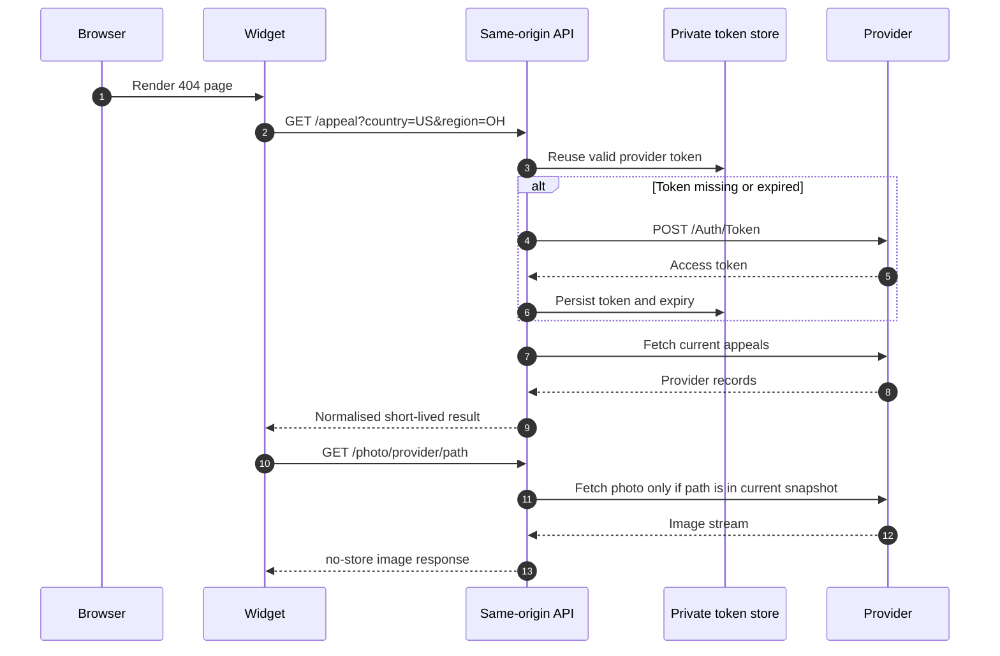
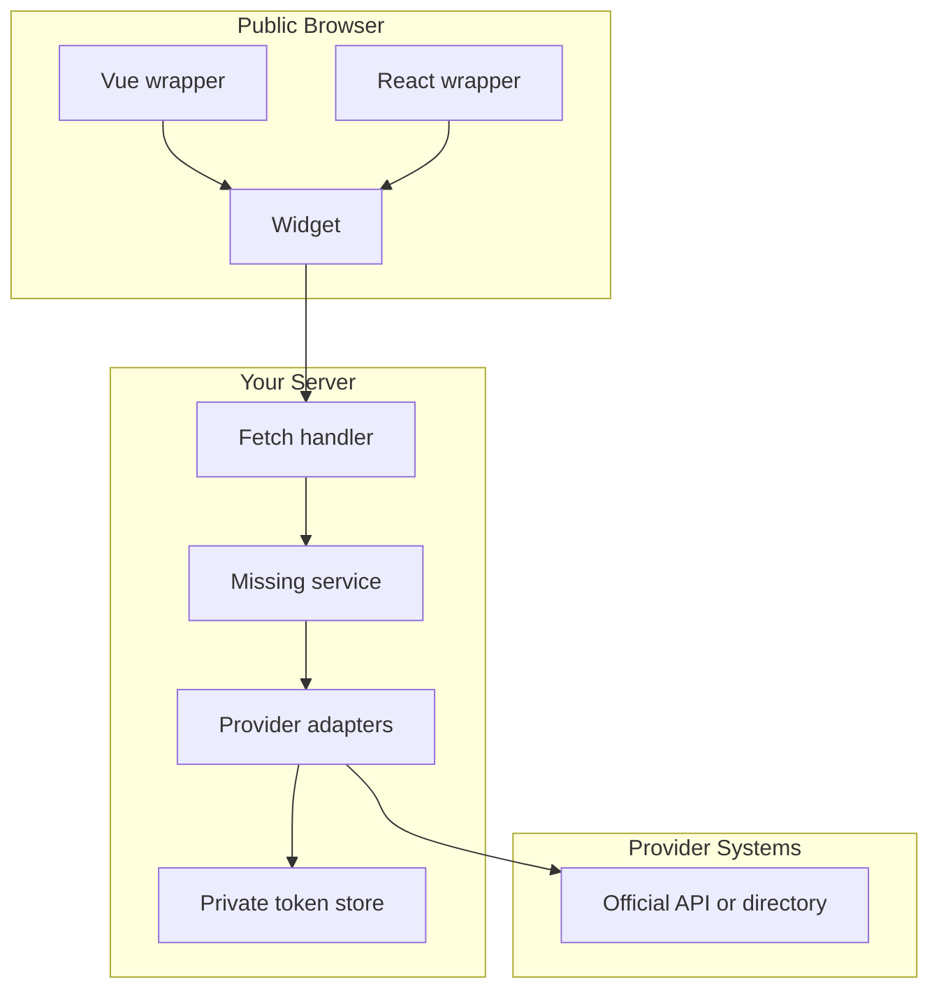

# Architecture

404 Missing is deliberately small. The website owns the route, the credentials
and the decision about which countries to support. The package provides the
boring, repeatable pieces.

## Request Flow



## Boundaries



The browser receives display data only. Credentials, provider tokens and raw
provider errors stay on the server.

## Token Storage

Provider tokens are not case data. They still belong in private durable storage.

| Host | Store |
| --- | --- |
| Persistent Node server | `createFileTokenStore('/private/path/ncmec-token.json')` |
| Netlify | `createNetlifyTokenStore(getStore({ name: '404-missing-private-auth', consistency: 'strong' }))` |
| Other serverless hosts | Implement the `TokenStore` interface with durable private storage. |

The store records access token, expiry and authentication cooldown only. It does
not store cases or photographs.

## Adding A Provider

0. Prerequisites:
   Written permission or terms that clearly allow your use, including display,
   caching, update, withdrawal and photography rules.

1. Implement the provider contract:

   ```ts
   import type { Provider } from '@dappa/404-missing/server'

   export const provider: Provider = {
     id: 'official-source',
     countries: ['GB'],
     async getAppeals(area) {
       return []
     },
     async getPhoto(path) {
       return new Response(null, { status: 404 })
     },
   }
   ```

2. Return records with official HTTPS appeal URLs, attribution, `checkedAt` and
   `expiresAt`.

3. Keep `expiresAt` no more than 60 seconds after `checkedAt`.

4. Add the provider to `createMissingService({ providers: [...] })`.

5. Check withdrawal behaviour:
   remove a provider record upstream or simulate its disappearance. Passing
   result: the API does not return stale case data and the widget shows the
   official directory fallback.

## Localisation

The package accepts an explicit country and optional region. It does not detect
location by IP, browser language or nationality.

Good sources for country selection:

- a site default, such as `GB` for a UK site
- a trusted server-side geo result you already use
- a visible visitor choice

Avoid hidden guesses. The public impact depends on showing a relevant official
appeal without pretending to know more than the site actually knows.
