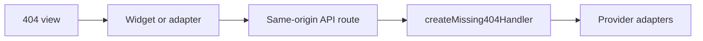

# Frameworks

Use the same mental model in every framework:



## Nuxt 3 Or 4

0. Prerequisites:
   Nuxt 3 or 4, Node 22+ and server-only environment variables.

1. Create `server/utils/missing-404.ts`:

   ```ts
   import { createMissing404Handler } from '@dappa/404-missing/server'
   import { createFileTokenStore } from '@dappa/404-missing/node'
   import { resolve } from 'node:path'

   let handler: ReturnType<typeof createMissing404Handler> | undefined

   export function missingHandler() {
     return handler ??= createMissing404Handler({
       defaultCountry: 'GB',
       ncmec: {
         clientId: process.env.NUXT_NCMEC_CLIENT_ID || process.env.NCMEC_CLIENT_ID || '',
         clientSecret: process.env.NUXT_NCMEC_CLIENT_SECRET || process.env.NCMEC_CLIENT_SECRET || '',
         tokenStore: createFileTokenStore(resolve('.data/private-404/ncmec-token.json')),
       },
     })
   }
   ```

2. Create `server/api/missing-children/[...path].get.ts`:

   ```ts
   import { defineEventHandler, sendWebResponse, toWebRequest } from 'h3'
   import { missingHandler } from '../../utils/missing-404'

   export default defineEventHandler(async event =>
     sendWebResponse(event, await missingHandler()(toWebRequest(event)))
   )
   ```

3. Add this to `error.vue` or `app/error.vue`:

   ```vue
   <script setup lang="ts">
   import MissingChild from '@dappa/404-missing/vue'

   defineProps<{ error: { statusCode: number } }>()
   </script>

   <template>
     <main>
       <h1>{{ error.statusCode === 404 ? 'Page not found' : 'Something went wrong' }}</h1>
       <a href="/">Back home</a>
       <MissingChild v-if="error.statusCode === 404" country="GB" />
     </main>
   </template>
   ```

4. Check:
   visit a real missing route. Passing result: HTTP 404, Back home link,
   country selector and official directory are visible.

## Next.js

0. Prerequisites:
   Next.js App Router, Node 22+ and server-only environment variables.

1. Create `lib/missing-404.ts`:

   ```ts
   import 'server-only'
   import { createMissing404Handler } from '@dappa/404-missing/server'
   import { createFileTokenStore } from '@dappa/404-missing/node'

   export const missingHandler = createMissing404Handler({
     defaultCountry: 'GB',
     ncmec: {
       clientId: process.env.NCMEC_CLIENT_ID || '',
       clientSecret: process.env.NCMEC_CLIENT_SECRET || '',
       tokenStore: createFileTokenStore('/var/lib/your-app/private/404-missing-ncmec-token.json'),
     },
   })
   ```

2. Create `app/api/missing-children/[...path]/route.ts`:

   ```ts
   import { missingHandler } from '@/lib/missing-404'

   export const GET = missingHandler
   export const HEAD = missingHandler
   ```

3. Render the React adapter in your not-found UI:

   ```tsx
   import { MissingChild } from '@dappa/404-missing/react'

   export default function NotFound() {
     return (
       <main>
         <h1>Page not found</h1>
         <a href="/">Back home</a>
         <MissingChild country="GB" />
       </main>
     )
   }
   ```

4. Check:
   visit a missing URL. Passing result: HTTP 404, server-rendered Back home link,
   card and official directory remain visible with JavaScript disabled or delayed.

## Astro

0. Prerequisites:
   Astro SSR, Node 22+ and a same-origin endpoint.

1. Create an endpoint that passes the Fetch request to `createFetchHandler`.

2. Add the element to the 404 page:

   ```astro
   <main>
     <h1>Page not found</h1>
     <a href="/">Back home</a>
     <missing-child country="GB" endpoint="/api/missing-children">
       <a href="https://www.missingpeople.org.uk/appeal-search">Official UK appeals</a>
     </missing-child>
   </main>

   <script>
     import { registerMissingChild } from '@dappa/404-missing/widget'
     registerMissingChild()
   </script>
   ```

3. Check:
   build and open a real missing route through the server. Passing result:
   the fallback link is present before the client script finishes loading.

## HTML Or Any Framework

0. Prerequisites:
   A server or serverless function that can host the Fetch handler.

1. Serve the API at `/api/missing-children`.

2. Serve the widget bundle and render:

   ```html
   <missing-child country="GB" endpoint="/api/missing-children">
     <a href="https://www.missingpeople.org.uk/appeal-search">Official UK appeals</a>
   </missing-child>
   <script type="module">
     import { registerMissingChild } from '/dist/widget.js'
     registerMissingChild()
   </script>
   ```

3. Check:
   open the missing page, then open DevTools Network. Passing result:
   `/api/missing-children/appeal` returns `200` with `no-store`, and the page
   response itself remains `404`.

## Ember

0. Prerequisites:
   Ember, a not-found route or template, and a same-origin API route mounted at
   `/api/missing-children`.

1. Register the web component once:

   ```js
   import { registerMissingChild } from '@dappa/404-missing/widget'

   registerMissingChild()
   ```

2. Render the custom element in the not-found template:

   ```hbs
   <main>
     <h1>Page not found</h1>
     <a href="/">Back home</a>
     <missing-child country="GB" endpoint="/api/missing-children">
       <a href="https://www.missingpeople.org.uk/appeal-search">Official UK appeals</a>
     </missing-child>
   </main>
   ```

3. Check:
   open the real Ember not-found route. Passing result: the card loads from the
   same-origin API and the official fallback remains visible if no inline appeal
   is available.
