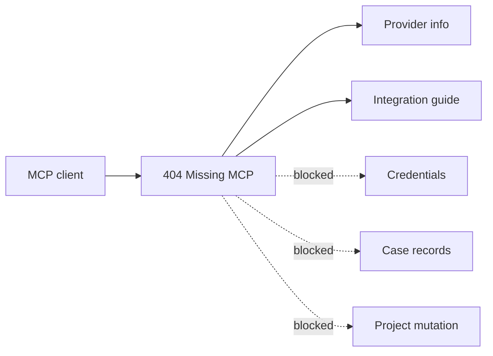

# MCP

404 Missing includes a local MCP server for setup guidance. It is intentionally
read-only and boring in the best way: it helps a developer integrate the package
without asking for credentials or returning case records.

## Setup

0. Prerequisites:
   Install 404 Missing in the project where your MCP client can read
   `node_modules`.

1. Add this server to your MCP client configuration:

   ```json
   {
     "mcpServers": {
       "404-missing": {
         "command": "node",
         "args": ["/absolute/path/to/project/node_modules/@dappa/404-missing/dist/mcp.js"]
       }
     }
   }
   ```

2. Restart the MCP client.

3. Ask for provider coverage or a framework guide.

## Tools

| Tool | Inputs | Returns |
| --- | --- | --- |
| `list_providers` | none | Supported and researched providers, countries, access requirements and official links. |
| `integration_guide` | `framework`: `nuxt`, `next`, `astro` or `html`; `country`: `GB` or `US` | A concise integration guide for that framework and country. |

## Safety Contract



The MCP server does not:

- read project files
- write project files
- accept provider credentials
- call provider APIs
- return personal case data
- proxy photographs

It gives guidance only. The website server performs real provider requests after
you configure the package there.
