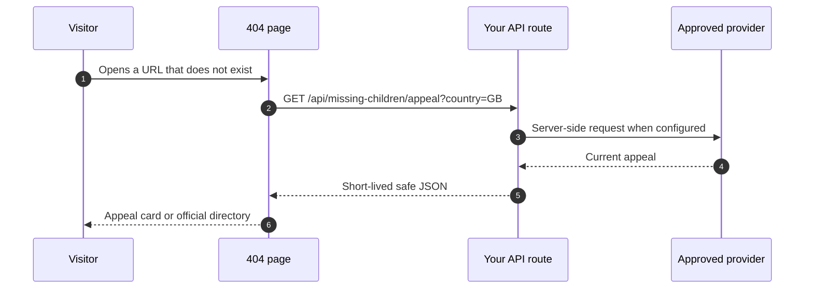

# Quick Start

This page is the copy-paste path. It keeps the decision count low and links out
only when the detail matters.

## The Shape



## Steps

0. Prerequisites:
   Node 22+, a server-rendered website and a route that can handle
   same-origin API requests. For inline US appeals, get your own
   [NCMEC approval](https://www.missingkids.org/gethelpnow/search/poster-api-registration).

1. Install the package in your website project:

   ```sh
   npm install https://github.com/dilrajahdan/404-missing/releases/download/v0.1.0/dappa-404-missing-0.1.0.tgz
   ```

2. Add server-only environment variables:

   ```dotenv
   NCMEC_CLIENT_ID=your-own-approved-client-id
   NCMEC_CLIENT_SECRET=your-own-approved-client-secret
   ```

3. Add an ignored private token directory:

   ```gitignore
   .data/
   ```

4. Create the server handler:

   ```ts
   import { createFetchHandler, createMissingService, createNcmecProvider } from '@dappa/404-missing/server'
   import { createFileTokenStore } from '@dappa/404-missing/node'

   let handler: ReturnType<typeof createFetchHandler> | undefined

   export function missingChildrenHandler() {
     return handler ??= createFetchHandler(createMissingService({
       defaultCountry: 'GB',
       providers: [createNcmecProvider({
         clientId: process.env.NCMEC_CLIENT_ID || '',
         clientSecret: process.env.NCMEC_CLIENT_SECRET || '',
         tokenStore: createFileTokenStore('.data/private-404/ncmec-token.json'),
       })],
     }))
   }
   ```

5. Mount the handler at `/api/missing-children`.

   Your route must forward `GET` and `HEAD` requests to the Fetch handler. The
   package expects these paths:

   ```text
   /api/missing-children/appeal
   /api/missing-children/photo/:provider/:path
   ```

6. Add the widget to the 404 page:

   ```html
   <a href="/">Back home</a>

   <missing-child country="GB" endpoint="/api/missing-children">
     <a href="https://www.missingpeople.org.uk/appeal-search">Official UK appeals</a>
   </missing-child>

   <script type="module">
     import { registerMissingChild } from '@dappa/404-missing/widget'
     registerMissingChild()
   </script>
   ```

7. Check the real page in this order:

   ```text
   1. Visit a URL that does not exist.
   2. Confirm the browser receives HTTP 404.
   3. Confirm the page still has a visible Back home link.
   4. Confirm the missing-child card appears.
   5. Confirm the official directory link opens the official organisation.
   6. Select United States if NCMEC credentials are configured.
   7. Confirm the official appeal opens.
   8. Confirm the photograph URL is same-origin under /api/missing-children/photo/.
   ```

An empty inline UK result is a pass today when the official UK directory remains
visible. Inline UK records need approved partner feed access or a registered
provider embed.

## Common Decisions

| Decision | Recommendation |
| --- | --- |
| Default country | Use the site's audience, for example `GB` for a UK site. |
| Visitor location | Pass a trusted server-side country if you already have one. Do not infer from browser language. |
| Token storage | Use a private persistent file on Node, Netlify Blobs on Netlify, or write a durable store for your host. |
| Case storage | Do not store cases or photos. Let the package refresh current data. |
| Static sites | Use a serverless API on the same origin. The widget alone is not enough for authenticated providers. |
