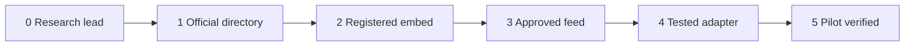

# Provider Roadmap

404 Missing grows by adding approved provider access country by country. The
goal is local relevance without guessing, scraping or storing sensitive content.

## Current Coverage

| Country or region | User experience now | What is needed next |
| --- | --- | --- |
| United States | Inline NCMEC appeal with approved credentials. | More regional contract tests and operator guidance. |
| United Kingdom | Official Missing People directory fallback. | Approved public appeal feed or registered NotFound.org embed per website. |
| Europe | Official global or provider directory fallback. | Country partner discovery through Missing Children Europe, AMBER Alert Europe, NotFound.org and national organisations. |
| Global | Global Missing Kids directory fallback. | ICMEC/GMCN partner route or country-specific adapters. |

## Help Wanted

| Track | Good first contribution | Harder contribution |
| --- | --- | --- |
| Provider research | Find official appeal, API, embed and partner links for one country. | Confirm terms with the provider and write an access note. |
| Provider adapter | Add a test-only provider fixture matching the shared `Provider` contract. | Build a real approved provider adapter with withdrawal tests. |
| Localisation | Improve labels for a country directory fallback. | Add translated UI strings after a real product requirement exists. |
| Frameworks | Add a minimal pattern for another framework. | Ship a maintained adapter package with SSR tests. |
| Verification | Add edge-case tests for no appeal, outage and photo failure. | Add provider contract tests that can run against approved credentials without storing case data. |

## Country Research Template

```md
## <Country>

- Official missing-child organisation:
- Official appeal search:
- API or feed:
- Embed route:
- Partner or contact page:
- Terms covering display:
- Attribution requirements:
- Reporting link:
- Cache and withdrawal rules:
- Status:
  - [ ] directory fallback only
  - [ ] registered embed possible
  - [ ] API/feed possible
  - [ ] approved adapter in progress
```

## Provider Readiness Levels



1. Research lead:
   official organisation and contact route found.

2. Official directory:
   safe fallback link available now.

3. Registered embed:
   provider issues an iframe or widget for each website.

4. Approved feed:
   provider confirms a JSON, XML or API feed may be used by this project.

5. Tested adapter:
   adapter has current, unavailable, withdrawal, outage and photo tests.

6. Pilot verified:
   a real site has exercised the 404 path end to end.

## Countries To Research Next

Start with countries where an official organisation already publishes public
appeals and has a clear contact route.

1. United Kingdom:
   Missing People feed or registered NotFound.org route.

2. Belgium, France, Italy, Spain, Greece and Cyprus:
   NotFound.org has country coverage through registered website embeds. Confirm
   exact registration, language and withdrawal behaviour per country.

3. Canada, Australia, New Zealand and Ireland:
   find official appeal directories, police-backed alert systems and partner
   contacts.

4. ICMEC/GMCN member countries:
   ask whether ICMEC can introduce approved country organisations or a partner
   API route.

5. INTERPOL Yellow Notices:
   continue legal and technical research only. Do not reproduce personal data or
   pictures from INTERPOL without permission that covers this exact use.

## Not In Scope

- Scraping demo pages, search pages or iframes.
- Reusing another website's key or embed.
- Visitor-submitted missing-person records.
- Facial recognition, automated identification or AI matching.
- Stale case backup after provider outage.
- Silent fallback from one country to another.

